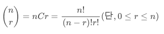

# 조합

> 순열과 다르게 n개 중에 r개를 뽑는데 순서를 고려하지 않는다.

### 수식



### 구현

```python
def combination(arr, r):
  for i in range(len(arr)): # 1)
    if r == 1:              # 2)
      yield [arr[i]]
    else:
      for next in combination(arr[i+1:], r-1): # 3)
        yield [arr[i]] + next
```

- 1. 주어진 배열의 원소들을 하나씩 순회한다.
- 2. 재귀함수의 종료조건 (뽑을 게 1개 밖에 없을 때)
- 3. 여기까지 오기 전에 i 번째 원소를 뽑았기 때문에 다음 단계에서는 `arr[i+1:]` (i+1 번째 부터 끝까지 자른) 원소중에서 뽑으면 됨

### 참조

- [combination 구현](https://blog.naver.com/PostView.nhn?blogId=kmh03214&logNo=221685090465&parentCategoryNo=&categoryNo=26&viewDate=&isShowPopularPosts=true&from=search)
